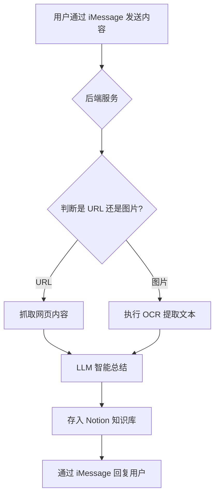

## 1. 产品概述
"Recall" 是一个基于 iMessage 的“第二大脑”助手，用于捕捉和组织碎片化的知识。它让用户可以毫不费力地保存来自网页和截图的灵感，这些内容会被 LLM 自动总结，并存入用户自己的 Notion 等知识库中。

## 2. 核心功能

### 2.1 用户角色
| 角色 | 注册方式 | 核心权限 |
|------|---------------------|------------------|
| 用户 | 通过 iMessage 连接并授权其知识库（如 Notion） | 可以发送链接和图片，接收总结，内容被保存到其知识库中。 |

### 2.2 功能模块
我们的 "Recall" 产品包含以下几个核心模块：
1.  **iMessage 交互界面**: 用户发送内容的主要入口。
2.  **内容处理服务**: 接收内容、判断类型（链接或图片）的后端服务。
3.  **智能总结模块**: 调用大语言模型（LLM）对内容进行总结。
4.  **知识库集成**: 连接用户的 Notion，并将总结后的内容存入。

### 2.3 页面详情
| 页面/界面 | 模块名称 | 功能描述 |
|-----------|-------------|---------------------|
| iMessage 聊天 | 内容提交 | - 转发或粘贴一个 URL。   - 粘贴或发送一张截图/图片。 |
| iMessage 聊天 | 状态更新 | - 收到内容后，发送确认消息。   - 发送总结后的核心观点。   - 发送指向新创建的 Notion 页面的链接。 |
| Web 门户 | 用户引导与设置 | - 用户注册与登录。   - 引导用户连接 iMessage。   - 授权并连接到用户的 Notion 工作空间。   - 查看已保存的条目历史。 |

## 3. 核心流程
主要的用户操作流程如下。用户首先需要通过 Web 门户完成注册和 Notion 集成设置。

**用户核心流程**:
1.  用户将一个 URL 或截图发送到 "Recall" 的 iMessage 联系人。
2.  后端服务接收到消息。
3.  如果消息是 URL，服务将抓取网页内容。如果是图片，将使用 OCR 提取文本（如果适用）。
4.  将提取的内容发送给大语言模型（LLM）进行总结。
5.  总结、原始链接/图片以及其他元数据，将被保存为用户已连接的 Notion 数据库中的一个新页面。
6.  一条包含总结和 Notion 页面链接的确认消息，会通过 iMessage 回复给用户。

**页面导航流程图**:

## 4. 用户界面设计

### 4.1 设计风格
- **主要界面**: 遵循 iMessage 的原生用户界面。
- **Web 门户**: 极简、干净的设计风格。
- **主色调**: 蓝色 (iMessage)、白色，并搭配一个简单的强调色。
- **字体**: 使用系统默认字体（如苹果设备的 San Francisco 字体）。
- **布局**: Web 门户采用卡片式布局和顶部导航。

### 4.2 页面设计概述
| 页面名称 | 模块名称 | UI 元素 |
|-----------|-------------|-------------|
| iMessage 聊天 | 对话界面 | 使用标准的 iMessage 聊天气泡进行消息收发。 |
| Web 门户 | 用户引导 | 简单、分步的向导，用于连接 iMessage 和授权 Notion。 |

### 4.3 响应式设计
- Web 门户需要是响应式的，同时支持桌面端和移动端访问。iMessage 本身是移动端应用。
