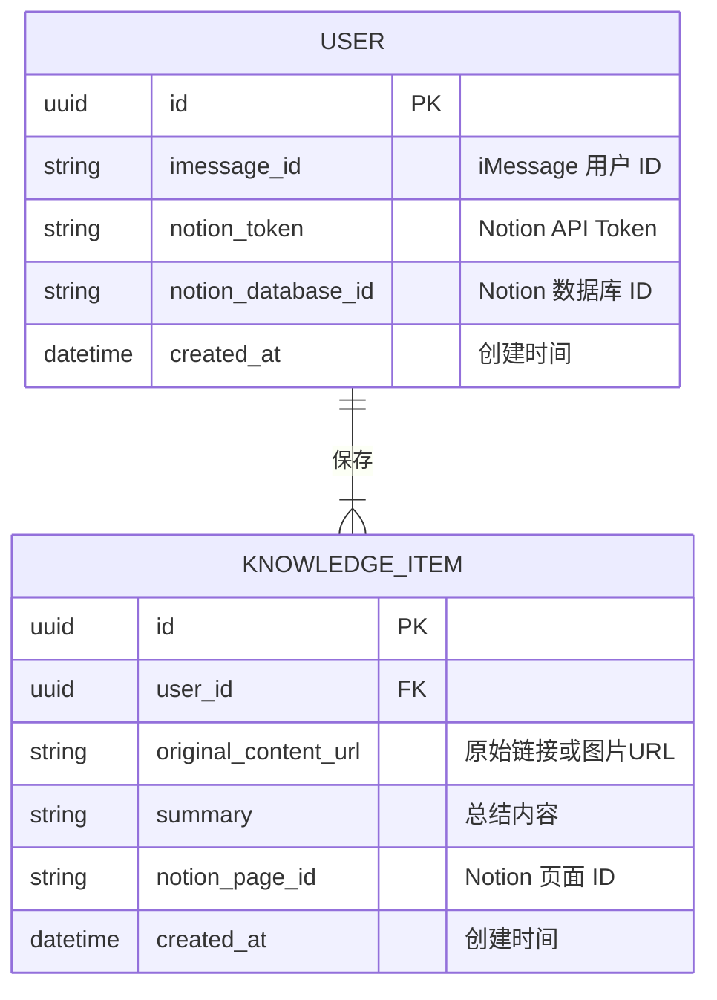

## 1. 架构设计
本项目的架构旨在实现一个通过 iMessage 接收信息，并由后端服务处理、总结、归档至 Notion 的流程。

```mermaid
graph TD
    A[用户的 iMessage] --> B[iMessage 集成服务];
    B --> C[后端应用 (Node.js/Express)];
    C --> D[LLM API (例如 OpenAI)];
    C --> E[Notion API];
    C --> F[Supabase 数据库];

    subgraph "用户设备"
        A
    end

    subgraph "集成层"
        B
    end

    subgraph "后端服务"
        C
    end

    subgraph "外部服务"
        D
        E
    end

    subgraph "数据层"
        F
    end
```

## 2. 技术栈描述
- **前端**: 无传统前端，主要交互通过 iMessage。一个用于用户引导和设置的简单 Web 门户将使用 React 和 Vite 构建。
- **初始化工具**: `vite-init`
- **后端**: Node.js + Express.js，用于处理核心业务逻辑。
- **数据库**: Supabase (PostgreSQL)，用于存储用户信息、Notion API 令牌和处理记录。
- **iMessage 集成**: iMessage 并未提供公开的 Bot API。此处的集成可能需要依赖 Apple Business Chat 服务或类似的第三方解决方案。

## 3. 路由定义
Web 门户的核心页面路由定义如下：

| 路由 | 用途 |
|-------|---------|
| / | 介绍产品功能的落地页 |
| /login | 用户登录和注册页面 |
| /dashboard | 用户面板，用于管理 Notion 集成和查看历史记录 |

## 4. API 定义
后端服务主要通过 Webhook 接收来自 iMessage 集成服务的消息。

### 4.1 核心 API
**接收 iMessage 消息**
```
POST /api/message
```

**请求体**:
| 参数名 | 参数类型 | 是否必须 | 描述 |
|-----------|-------------|-------------|-------------|
| userId | string | true | 用户的唯一标识符 |
| type | string | true | 消息类型 ('text' or 'image') |
| content | string | true | 消息内容 (URL 或 base64 编码的图片) |

**响应**:
| 参数名 | 参数类型 | 描述 |
|-----------|-------------|-------------|
| status | string | 'success' 或 'error' |
| message | string | 描述信息 |

## 5. 服务端架构
```mermaid
graph TD
    A[iMessage 集成服务] --> B[Controller 层];
    B --> C[Service 层];
    C --> D[LLM 服务模块];
    C --> E[Notion 服务模块];
    C --> F[数据库仓库 (Repository)];
    F --> G[(Supabase DB)];

    subgraph "后端服务器"
        B
        C
        D
        E
        F
    end
```

## 6. 数据模型

### 6.1 数据模型定义


### 6.2 数据定义语言 (DDL)
```sql
-- 用户表 (users)
CREATE TABLE users (
    id UUID PRIMARY KEY DEFAULT gen_random_uuid(),
    imessage_id VARCHAR(255) UNIQUE NOT NULL,
    notion_token TEXT NOT NULL,
    notion_database_id VARCHAR(255) NOT NULL,
    created_at TIMESTAMP WITH TIME ZONE DEFAULT NOW()
);

-- 知识条目表 (knowledge_items)
CREATE TABLE knowledge_items (
    id UUID PRIMARY KEY DEFAULT gen_random_uuid(),
    user_id UUID REFERENCES users(id) ON DELETE CASCADE,
    original_content_url TEXT,
    summary TEXT,
    notion_page_id VARCHAR(255),
    created_at TIMESTAMP WITH TIME ZONE DEFAULT NOW()
);

-- 为 users 表启用行级安全
ALTER TABLE users ENABLE ROW LEVEL SECURITY;
-- 授予 anon 角色基本读取权限
GRANT SELECT ON users TO anon;
-- 授予 authenticated 角色完全权限
GRANT ALL PRIVILEGES ON users TO authenticated;

-- 定义 RLS 策略
CREATE POLICY "用户可以查看和管理自己的信息" ON users
    FOR ALL USING (auth.uid() = id)
    WITH CHECK (auth.uid() = id);


-- 为 knowledge_items 表启用行级安全
ALTER TABLE knowledge_items ENABLE ROW LEVEL SECURITY;
-- 授予 anon 角色基本读取权限
GRANT SELECT ON knowledge_items TO anon;
-- 授予 authenticated 角色完全权限
GRANT ALL PRIVILEGES ON knowledge_items TO authenticated;

-- 定义 RLS 策略
CREATE POLICY "用户可以查看和管理自己的知识条目" ON knowledge_items
    FOR ALL USING (auth.uid() = user_id)
    WITH CHECK (auth.uid() = user_id);

-- 创建索引
CREATE INDEX idx_knowledge_items_user_id ON knowledge_items(user_id);
```